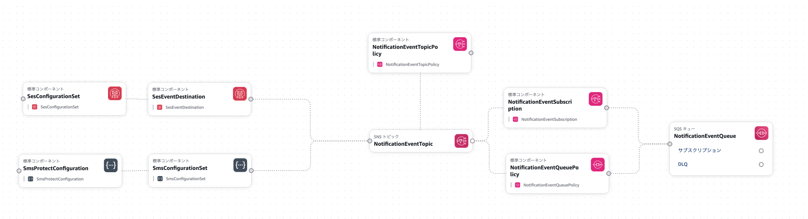

# Notification-Event-Triggers

AWS SES（Email）および AWS End User Messaging（SMS）の通知イベントを SNS → SQS で受け取れることを検証する POC リポジトリ。

## 目的

SES / EUM が発行するイベント（バウンス、配信失敗など）を本当にキャッチできるのかを実際に動かして確認する。

## アーキテクチャ



### POC（本リポジトリのスコープ）

```
SES / EUM → SNS → SQS（コンシューマーなし）
```

SQS にメッセージが入ってきたことを確認し、メッセージの中身を確認できたらゴール。

### プロダクション（最終形イメージ）

```
SES / EUM → SNS → SQS → ECS（ロングポーリング） → DB 更新
```

## 対象イベント

### SES（Email）

| イベント      | 意味               |
|-----------|------------------|
| Bounce    | 宛先不明・メールボックス満杯など |
| Complaint | 受信者がスパム報告        |
| Delivery  | 正常に配信された         |

### EUM（SMS）

| イベント                     | 意味            |
|--------------------------|---------------|
| TEXT_SUCCESSFUL          | 正常に配信された      |
| TEXT_FAILED              | 送信失敗（汎用）      |
| TEXT_TTL_EXPIRED         | 配信タイムアウト      |
| TEXT_BLOCKED             | メッセージがブロックされた |
| TEXT_CARRIER_BLOCKED     | キャリア側で拒否      |
| TEXT_INVALID             | 無効な電話番号       |
| TEXT_CARRIER_UNREACHABLE | キャリアに到達できない   |
| TEXT_UNKNOWN             | 不明なエラー        |

## イベント再現方法

### SES

| イベント      | 再現方法                                                    |
|-----------|---------------------------------------------------------|
| Bounce    | SES メールボックスシミュレーター（`bounce@simulator.amazonses.com`）    |
| Complaint | SES メールボックスシミュレーター（`complaint@simulator.amazonses.com`） |
| Delivery  | 個人メールアドレス宛に送信                                           |

### EUM（SMS）

| イベント          | 再現方法                        |
|---------------|-----------------------------|
| Delivery      | 個人番号宛に送信                    |
| Blocked 系     | 個人番号で受信後「STOP」返信 → 再送信（要検証） |
| その他 Failure 系 | 要検証（シミュレーター機能なし）            |

> **注意**: SMS はシミュレーター機能がないため、テスト送信でも実際の料金が発生する。

## インフラ

CloudFormation で構築する。
ドメインなどの手動作成のリソースは外部パラメータとして受け取る。

### 認証確認

```bash
aws sts get-caller-identity
```

### 変更セット作成（ドライラン）

```bash
aws cloudformation deploy \
  --template-file template.yml \
  --stack-name notification-event-triggers \
  --capabilities CAPABILITY_NAMED_IAM \
  --parameter-overrides \
  DomainName=<ドメイン名> \
  HostedZoneId=<ホストゾーンID> \
  --no-execute-changeset
```

### デプロイ

```bash
aws cloudformation deploy \
  --template-file template.yml \
  --stack-name notification-event-triggers \
  --capabilities CAPABILITY_NAMED_IAM \
  --parameter-overrides \
  DomainName=<ドメイン名> \
  HostedZoneId=<ホストゾーンID> \
```

### 削除

```bash
aws cloudformation delete-stack \
  --stack-name notification-event-triggers
```

### SES 送信制御ポリシー（任意：手動作成）

SES コンソール → Identity（ドメイン） → Authorization タブ → Create Policy で以下を設定する。

```json
{
  "Version": "2012-10-17",
  "Statement": [
    {
      "Effect": "Allow",
      "Principal": {
        "AWS": "arn:aws:iam::<アカウントID>:root"
      },
      "Action": [
        "ses:SendEmail",
        "ses:SendRawEmail"
      ],
      "Resource": "arn:aws:ses:<リージョン>:<アカウントID>:identity/<ドメイン名>",
      "Condition": {
        "StringLike": {
          "ses:FromAddress": "*@<ドメイン名>"
        },
        "ForAllValues:StringLike": {
          "ses:Recipients": [
            "<許可する送信先1>",
            "<許可する送信先2>",
            "<許可する送信先3>",
            "*@simulator.amazonses.com"
          ]
        }
      }
    }
  ]
}
```

### 検証（SNSへメッセージを送信）

```bash
aws sns publish \
    --topic-arn <トピックARN> \
    --message '{"test": "hello"}'
```

### 検証（SESでメールを送信する）

```bash
aws ses send-email \
    --from yumee@notification-poc.click \
    --destination "ToAddresses=the.second.glide@gmail.com" \
    --message "Subject={Data=Test Email},Body={Text={Data=Hello World}}"
    --configuration-set-name notification-event-config
```

```log
{
  "eventType": "Delivery",
  "mail": {
    "timestamp": "2026-07-27T11:51:10.600Z",
    "source": "yumee@notification-poc.click",
    "sourceArn": "arn:aws:ses:ap-northeast-1:195950944431:identity/notification-poc.click",
    "sendingAccountId": "195950944431",
    "messageId": "0106019fa36a2608-6c9654bb-dc58-4957-8828-68360c1c2d10-000000",
    "destination": [
      "tXXXXXXXXXXXXe@gmail.com"
    ],
    "headersTruncated": false,
    "headers": [
      {
        "name": "From",
        "value": "yumee@notification-poc.click"
      },
      {
        "name": "To",
        "value": "the.second.glide@gmail.com"
      },
      {
        "name": "Subject",
        "value": "Test Email"
      },
      {
        "name": "MIME-Version",
        "value": "1.0"
      },
      {
        "name": "Content-Type",
        "value": "text/plain; charset=UTF-8"
      },
      {
        "name": "Content-Transfer-Encoding",
        "value": "7bit"
      }
    ],
    "commonHeaders": {
      "from": [
        "yumee@notification-poc.click"
      ],
      "to": [
        "the.second.glide@gmail.com"
      ],
      "messageId": "0106019fa36a2608-6c9654bb-dc58-4957-8828-68360c1c2d10-000000",
      "subject": "Test Email"
    },
    "tags": {
      "ses:source-tls-version": [
        "TLSv1.3"
      ],
      "ses:operation": [
        "SendEmail"
      ],
      "ses:configuration-set": [
        "notification-event-config"
      ],
      "ses:outgoing-tls-version": [
        "TLSv1.3"
      ],
      "ses:source-ip": [
        "175.107.153.145"
      ],
      "ses:from-domain": [
        "notification-poc.click"
      ],
      "ses:caller-identity": [
        "AdminRole"
      ],
      "ses:outgoing-ip": [
        "23.251.234.11"
      ]
    }
  },
  "delivery": {
    "timestamp": "2026-07-27T11:51:11.540Z",
    "processingTimeMillis": 940,
    "recipients": [
      "the.second.glide@gmail.com"
    ],
    "smtpResponse": "250 2.0.0 OK  1785153071 41be03b00d2f7-cbbb67149cesi11379409a12.176 - gsmtp",
    "remoteMtaIp": "172.217.221.26",
    "reportingMTA": "e234-11.smtp-out.ap-northeast-1.amazonses.com"
  }
}
```

### 検証（SESシミュレーターへメールを送信する）

```bash
aws ses send-email \
    --from yumee@notification-poc.click \
    --destination "ToAddresses=complaint@simulator.amazonses.com" \
    --message "Subject={Data=Test},Body={Text={Data=Test email}}" \
    --configuration-set-name notification-event-config
```

```log
{
  "eventType": "Complaint",
  "complaint": {
    "feedbackId": "0106019fa38f2b53-77f218b1-3b60-4ae1-bdc9-a3256a0b302c-000000",
    "complaintSubType": null,
    "complainedRecipients": [
      {
        "emailAddress": "complaint@simulator.amazonses.com"
      }
    ],
    "timestamp": "2026-07-27T12:31:36.712Z",
    "userAgent": "Amazon SES Mailbox Simulator",
    "complaintFeedbackType": "abuse",
    "arrivalDate": "2026-07-27T12:31:36.712Z"
  },
  "mail": {
    "timestamp": "2026-07-27T12:31:32.949Z",
    "source": "yumee@notification-poc.click",
    "sourceArn": "arn:aws:ses:ap-northeast-1:195950944431:identity/notification-poc.click",
    "sendingAccountId": "195950944431",
    "messageId": "0106019fa38f1c55-b2f812a4-b841-4e14-bb91-3feff941d97b-000000",
    "destination": [
      "complaint@simulator.amazonses.com"
    ],
    "headersTruncated": false,
    "headers": [
      {
        "name": "From",
        "value": "yumee@notification-poc.click"
      },
      {
        "name": "To",
        "value": "complaint@simulator.amazonses.com"
      },
      {
        "name": "Subject",
        "value": "Test"
      },
      {
        "name": "MIME-Version",
        "value": "1.0"
      },
      {
        "name": "Content-Type",
        "value": "text/plain; charset=UTF-8"
      },
      {
        "name": "Content-Transfer-Encoding",
        "value": "7bit"
      }
    ],
    "commonHeaders": {
      "from": [
        "yumee@notification-poc.click"
      ],
      "to": [
        "complaint@simulator.amazonses.com"
      ],
      "messageId": "0106019fa38f1c55-b2f812a4-b841-4e14-bb91-3feff941d97b-000000",
      "subject": "Test"
    },
    "tags": {
      "ses:source-tls-version": [
        "TLSv1.3"
      ],
      "ses:operation": [
        "SendEmail"
      ],
      "ses:configuration-set": [
        "notification-event-config"
      ],
      "ses:source-ip": [
        "175.107.153.145"
      ],
      "ses:from-domain": [
        "notification-poc.click"
      ],
      "ses:caller-identity": [
        "AdminRole"
      ]
    }
  }
}
```

### 検証（EUMでSMSを送信する）

```bash
aws pinpoint-sms-voice-v2 send-text-message \
  --destination-phone-number "<送信先E.164形式電話番号>" \
  --origination-identity "NOTIFY-POC" \
  --message-body "テストメッセージです" \
  --message-type TRANSACTIONAL \
  --configuration-set-name "sms-event-config"
```

```log
{
  "eventType": "TEXT_DELIVERED",
  "eventVersion": "1.0",
  "eventTimestamp": 1785153895407,
  "isFinal": true,
  "originationPhoneNumber": "NOTIFY-POC",
  "destinationPhoneNumber": "+8190XXXXXXXX",
  "isoCountryCode": "JP",
  "isInternationalSend": false,
  "mcc": "440",
  "mnc": "54",
  "carrierName": "KDDI",
  "messageId": "bf66ad80-8bd5-4dc3-bc56-efb20b0b09aa",
  "messageRequestTimestamp": 1785153888712,
  "messageEncoding": "UNICODE",
  "messageType": "TRANSACTIONAL",
  "messageStatus": "DELIVERED",
  "messageStatusDescription": "Message has been accepted by phone",
  "totalMessageParts": 1,
  "totalMessagePrice": 0.07451,
  "totalCarrierFee": 0.0,
  "protectConfiguration": {
    "protectConfigurationId": "protect-fbfe2a1597ed46dc8ea7a617bbfbae9f",
    "protectStatus": "ALLOW"
  }
}
```

### 検証（EUMでSMSを送信するが一時的に電電を切りエラーを起こす） TTL 60秒で配信タイムアウトを発生させる場合のコマンド例。

```bash
aws pinpoint-sms-voice-v2 send-text-message \
  --destination-phone-number "<送信先E.164形式電話番号>" \
  --origination-identity "NOTIFY-POC" \
  --message-body "到達不可・TTLテストです" \
  --message-type TRANSACTIONAL \
  --configuration-set-name "sms-event-config" \
  --time-to-live 60
```

```log
{
  "eventType": "TEXT_TTL_EXPIRED",
  "eventVersion": "1.0",
  "eventTimestamp": 1785154612980,
  "isFinal": true,
  "originationPhoneNumber": "NOTIFY-POC",
  "destinationPhoneNumber": "+8190XXXXXXXX",
  "isoCountryCode": "JP",
  "isInternationalSend": false,
  "mcc": "440",
  "mnc": "54",
  "carrierName": "KDDI",
  "messageId": "21b6009a-87c7-4467-9b39-f897ae9604e8",
  "messageRequestTimestamp": 1785154516011,
  "messageEncoding": "UNICODE",
  "messageType": "TRANSACTIONAL",
  "messageStatus": "TTL_EXPIRED",
  "messageStatusDescription": "The delivery TTL has expired",
  "totalMessageParts": 1,
  "totalMessagePrice": 0.07451,
  "totalCarrierFee": 0.0,
  "protectConfiguration": {
    "protectConfigurationId": "protect-fbfe2a1597ed46dc8ea7a617bbfbae9f",
    "protectStatus": "ALLOW"
  }
}
```

シミュレーターの種類：

- complaint@simulator.amazonses.com に送る → Complaint イベントだけが発火
- bounce@simulator.amazonses.com に送る → Bounce イベントだけが発火
- success@simulator.amazonses.com に送る → Delivery イベントだけが発火
- suppressionlist@simulator.amazonses.com → アカウントのSuppression listに登録されている場合にBounceイベントが発火
- ooto@simulator.amazonses.com → Out of Office（不在通知）イベントが発火

### 参考にした記事

- [Amazon SESで送信元と宛先の制限をかけてみたメモ](https://qiita.com/kumeneko/items/423bcf2d0fdefbd54334)
- [SPFとは？SPFの意味やDKIM・DMARCとの違いを分かりやすく解説](https://am.arara.com/blog/06)
- [IPレピュテーション・ドメインレピュテーションとは？ 違いや確認方法、向上のポイントを解説](EiwAkZgxixSb59tDajc7hM8U45d8CbxhGOJO9JykHJjKMIFp8JJWrxVWTIs0pxoCvxQQAvD_BwE)
- [Amazon SES の新機能 Virtual Deliverability Manager を使ってみた](https://dev.classmethod.jp/articles/amazon-ses-vdm/)
- [【AWS End User Messaging SMS #1】SMS送信の新たな選択肢、AWS End User Messaging SMSとは？](https://qiita.com/miruky/items/9c38108e61062301630c)

## ゴール

- [x] SES イベント（Bounce / Complaint / Delivery）が SQS に届くことを確認
- [x] EUM イベント（Delivery / Failure 系）が SQS に届くことを確認
- [x] 各メッセージの JSON 構造を確認・記録
